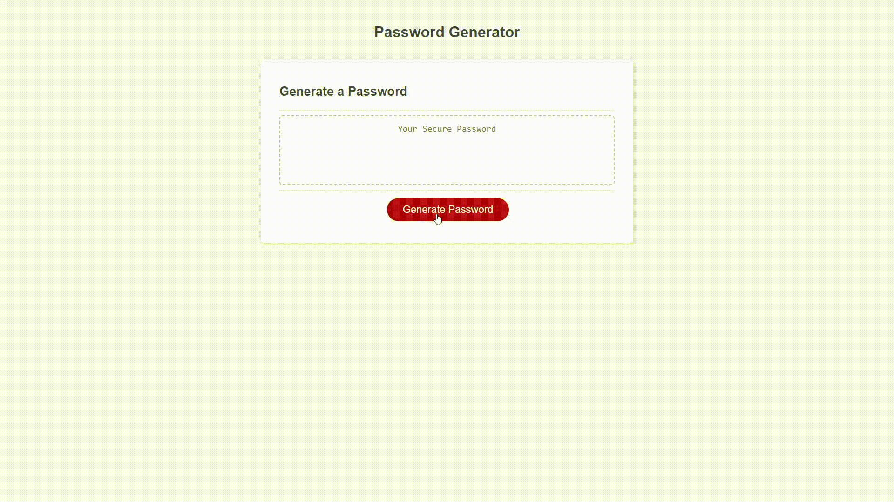

# 03 JavaScript: Password Generator

## About

This is a small tool that allows someone to autogenerate a secure, randomized password.

## Task

For this task, I was to modify starter code to create a password generate that allows users to set a few customer options. Using Javascript, I was to query a user for information and then display a randomized set of characters based on their selection. 

## Link to Deployed Application

[John Kersey's deployed application](https://johnkersey2.github.io/passwordGenerator/)

## Screenshot of Application

## Acceptance Critera

Being asking users for information when the "generate password" button is hit. 

Show a prompt allowing user to input a number between 8 and 128. 

Have the user pick what types of characters they want in their password. 

Make sure there is one valid input criteria before letting the funciton move on

Generate a randomized password when the user answers all the applications questions. 

## Known Issues

## Contributors

John Kersey 